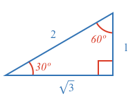
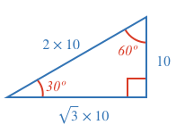
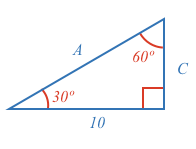
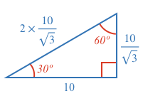
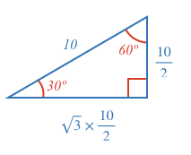

The 30-60-90 triangle has the following side proportions:

The examples below uses these proportions to find the unknown sides.

### Example 1

What are the lengths of sides A and B?

<hintLow>[Answer]
Sides $$A$$ and $$B$$ are multiples of the known side, where the multiples come directly from the 30-60-90 triangle proportions above:

</hintLow>

### Example 2

What are the lengths of sides A and C?

<hintLow>[Answer]
The known side is $$\sqrt{3}$$ times longer than side $$C$$, which means we can divide it by $$\sqrt{3}$$ to find $$C$$.

Once we have $$C$$ we can multiply it by 2 to find $$A$$.

</hintLow>

### Example 3

What are the lengths of sides B and C?

<hintLow>[Answer]
The known side is 2 times longer than side $$C$$, which means we can divide it by 2 to find $$C$$.

Once we have $$C$$ we can multiply it by $$\sqrt{3}$$ to find $$B$$

</hintLow>
