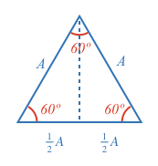
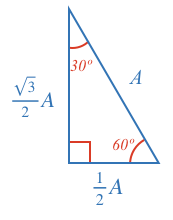

Consider an [[equilateral triangle]]((qr,'Math/Geometry_1/Equilateral/base/Main',#00756F)) split such that one side is halved.

Each smaller triangle has the same corresponding side lengths, so by [[SSS]]((qr,'Math/Geometry_1/CongruentTriangles/base/Sss',#00756F)) they are the same (congruent). As such:

* Their corresponding angles are equal.
* The top angle must be 30º (half of 60º).
* The bottom angle is 90º as the sum of all angles is [[180º]]((qr,'Math/Geometry_1/Triangles/base/AngleSum',#00756F)) and we have a 60º and 30º angle already.

Use the [[Pythagorean Theorem]]((qr,'Math/Geometry_1/RightAngleTriangles/base/Pythagorus',#00756F)) to solve for $$H$$.

$$H^2 + \left(\frac{1}{2}A\right)^2 = A^2$$

$$H^2 = A^2 - \frac{1}{4}A^2$$

$$H^2 = \frac{3}{4}A^2$$

$$H = \frac{\sqrt{3}}{2}A$$

We now have:

To remove the fractions, we can multiply all sides by 2. Also, people often show the triangle substituting $$A = 1$$.

Any time you come accross a right angle triangle with a 30º or 60º angle, you will know the proportion of the sides is $$1$$, $$\sqrt3$$ and $$2$$.
