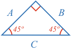
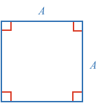
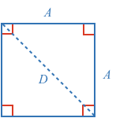
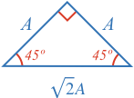
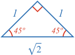

[[Similar triangles]]((qr,'Math/Geometry_1/SimilarTriangles/base/SimilarPres',#00756F)) are triangles that have the same shape, but may be a different size. In other words, their corresponding angles are equal, and their corresponding sides are all scaled by the same factor.

This means that all triangles with the same set of angles will have the same ratio between their sides. If one side is twice as long as another, then it will be the same in all similar triangles.

For some special triangles, it is possible to calculate these ratios geometrically.

Can you calculate the values of $$A$$, $$B$$ and $$C$$ for the right angle triangle with two 45º angles?

<hint>Start with a square.</hint>

<hintLow>
Is there a 45º-45º-90º triangle within a square, and if so can you calculate its side lengths?

</hintLow>

<hintLow>
Remember the following:

* All angles in a triangle [[add to 180º]]((qr,'Math/Geometry_1/Triangles/base/AngleSum',#00756F)).
* [[SSS]]((qr,'Math/Geometry_1/CongruentTriangles/base/Sss',#00756F)), [[SAS]]((qr,'Math/Geometry_1/CongruentTriangles/base/Sas',#00756F)), or [[Isosceles triangles]]((qr,'Math/Geometry_1/Isosceles/base/Main',#00756F)) (you only need one of these depending on the path you take).
* [[Pythagorean Theorem]]((qr,'Math/Geometry_1/RightAngleTriangles/base/Pythagorus',#00756F)).
</hintLow>

<hintLow>
Consider a square split along its diagonal.

We can solve for D using the [[Pythagorean Theorem]]((qr,'Math/Geometry_1/RightAngleTriangles/base/Pythagorus',#00756F)).

$$D^2 = A^2 + A^2$$

$$\sqrt{D^2} = \sqrt{2A^2}$$

$$D = \sqrt{2}A$$

The two other angles of the triangle will be 45º as:

* A triangle's angles [[add to 180º]]((qr,'Math/Geometry_1/Triangles/base/AngleSum',#00756F)), and we know one angle is 90º.
* They are [[isosceles triangles]]((qr,'Math/Geometry_1/Isosceles/base/Main',#00756F)) and therefore their remaining angles are equal. You could also prove the two angles are equal by showing the two triangles are congruent by [[SSS]]((qr,'Math/Geometry_1/CongruentTriangles/base/Sss',#00756F)) or [[SAS]]((qr,'Math/Geometry_1/CongruentTriangles/base/Sas',#00756F)) and therefore are equal halves of the square.

Thus we have:

Often the $$A$$ is substituted for a $$1$$:

Any time you come accross a right angle triangle with a 45º angle, you will know the proportion of the sides is $$1$$, $$1$$ and $$\sqrt{2}$$.
</hintLow>