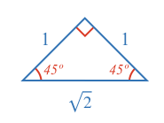
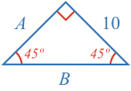
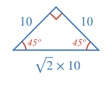
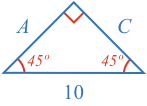

The 45-45-90 triangle has the following side proportions:

The examples below uses these proportions to find the unknown sides.

### Example 1

What are the lengths of sides A and B?

<hintLow>[Answer]
Side $$A$$ is equal to the known side.

Side $$C$$ is a $$\sqrt{2}$$ times longer than the known side.

</hintLow>

### Example 2

What are the lengths of sides A and C?

<hintLow>[Answer]
The known side is $$\sqrt{2}$$ times longer than sides $$A$$ and $$C$$, which means we can divide the known side length by $$\sqrt{2}$$ to find $$A$$ and $$C$$.

</hintLow>
