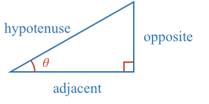
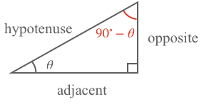

### Sine Function

In the sine function topic, we showed that the ratio of any two sides of a right angle triangle is the same for all right angle triangles with the same angle $$\theta$$.

In particular, the ratio of the opposite side and hypotenuse is described by the sine function.

$$\sin\left(\theta\right) = \frac{opposite}{hypotenuse}$$

### Cosine Function

Now, let’s consider the third angle which is the complementary angle of $$\theta$$:

Using the labels of this triangle, we can see the side opposite the third angle is the side adjacent to $$\theta$$. Therefore the sine of the third angle is:

$$\sin\left(90^\circ - \theta\right) = \frac{adjacent}{hypotenuse}$$

Here we have described the sine of the complimentary angle of theta, therefore this function is often called the complimentary sine, or **cosine** of $$\theta$$. Cosine is usually abbreviated to just **cos**.

$$\sin\left(90^\circ - \theta\right) = \cos\left(\theta\right)$$

In other words, the ratio between the side adjacent to an angle of a right angle triangle and the hypotenuse is the cosine function.

$$\cos\left(\theta\right)=\frac{adjacent}{hypotenuse} = \sin\left(90^\circ-\theta\right)$$

The cosine function can be calculated directly from the sine function.

$$\cos\left(\theta\right)= \sin\left(90^\circ-\theta\right)$$

You can therefore use a table of sines to find the cosine of an angle by looking up the complement of the angle.

However, throughout history a table of cosines was used instead where the angle could be directly referenced in the table. Similarly, a cos button exists on all calculators with a sin button.

Now, let’s consider the cosine of the third angle. In this case, the adjacent side is the side opposite to $$\theta$$.

$$\cos\left(90^\circ-a\right) = \frac{opposite}{hypotenuse} = \sin\left(a\right)$$

And so we have found an expression to calculate sine from cosine:

$$\sin\left(a\right) = \cos\left(90^\circ-a\right)$$

<!-- ### Example Equation:

$$\definecolor{g}{RGB}{29,177,0}\definecolor{b}{RGB}{0,118,186}\definecolor{r}{RGB}{238,34,12}\definecolor{v}{RGB}{203,41,123}\defineColor{gr}{100,100,100}$$

### Example Image

### Example QR
[[here]]((qr,'Math/Geometry_1/Triangles/base/AngleSumPres',#00756F)) -->