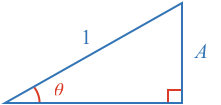
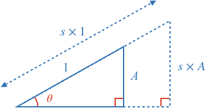
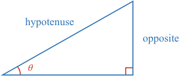

Consider a right angle triangle with known angle $$\theta$$ and a hypotenuse of length 1.

These three properties satisfy the [[AAS]]((qr,'Math/Geometry_1/CongruentTriangles/base/Aas',#00756F)) condition for congruent triangles, thus there can only be one possible dimension for side A, the side opposite the angle $$\theta$$. 

**(1) Therefore for any angle $$\theta$$, there can only be one possible opposite side length for a fixed length hypotenuse in a right angle triangle.**

As all angles in a triangle [[add to 180º]]((qr,'Math/Geometry_1/Triangles/base/AngleSumPres',#00756F)).

* If one angle is 90º, then the other two must add to 90º, and therefore each be less than 90º
* Thus sweeping theta between 0º and 90º covers all possible angle combinations of right angle triangles.

**Therefore (1) holds for all right angle triangles**

We can say the when the hypotenuse is 1, the opposite side is a function of the angle theta $$\theta$$:

$$opposite_{hypotenuse = 1} = function \left( \theta \right)$$

This function has been studied for millennia, and is now called the *sine* function (often abbreviated to *sin*).

$$opposite_{hypotenuse = 1} = \sin \left( \theta \right)$$

If we scale the hypotenuse without changing the angles, we create a [[similar]]((qr,'Math/Geometry_1/SimilarTriangles/base/SimilarPres',#00756F)) triangle. All sides in a similar triangle are scaled by the same amount. 

$$opposite_{hypotenuse = s} = s \times \sin \left( \theta \right)$$

As s is the hypotenuse of any triangle, we can generalize this:

$$opposite = hypotenuse \times \sin \left( \theta \right)$$

This is often rearranged to show that the sine function is the ratio of the opposite side and the hypotenuse.

$$\bbox[10px,border:1px solid gray]{\sin \left( \theta \right) = \frac{opposite}{hypotenuse}}$$

This relationship applies to all right angle triangles as we have shown the sine function that comes from all possible right angle triangles with hypotenuse 1, and can be extended to any hypotenuse length by using similar triangles.

### Sine function value
Calculating the actual value of the sine function can be difficult.

In the first century CE, geometry was used to prove the sines of specific angles. In 1400 CE, a formula was found that precisely calculates the sine of any angle. Both these methods involve calculations that without a calculator can be long and difficult.

$$ \sin\left(\theta\right) = \theta - \frac{\theta^3}{3!} + \frac{\theta^5}{5!} - \frac{\theta^7}{7!} + ...$$

Therefore up until the 20th century, published [[tables]]((qr,'Math/Trigonometry_1/Sine/base/TableOfSines',#00756F)) of sine values between 0º and 90º were used until calculators and computers superseded them.

<!-- ## Pythagorean Theorem -->
<!-- 
### Example Equation:

$$\definecolor{g}{RGB}{29,177,0}\definecolor{b}{RGB}{0,118,186}\definecolor{r}{RGB}{238,34,12}\definecolor{v}{RGB}{203,41,123}\defineColor{gr}{100,100,100}$$

### Example Image

### Example QR
[[here]]((qr,'Math/Geometry_1/Triangles/base/AngleSumPres',#00756F)) -->