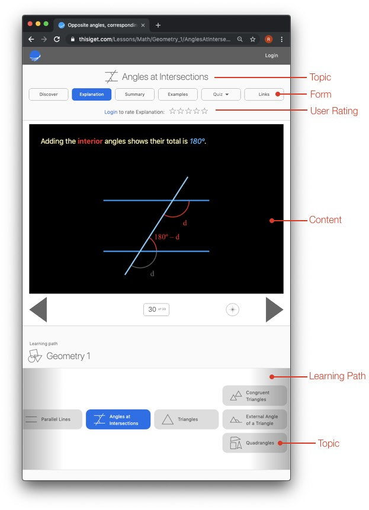
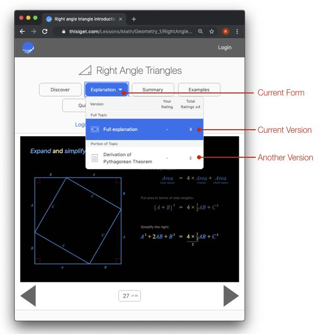

# Introduction

If you are new to www.thisiget.com, or want to develop for it, then this  

Some terms used to describe and highlight various parts of this website are below.

Below is a screenshot of a typical page on this site with some areas labeled.

## Terminology

### Topic
A “Topic” is the site’s fundamental unit, and is a relatively contained piece of content. A topic’s required knowledge and desired learnings should be clearly defined.

An example of a topic might be “Isosceles Triangle”. This topic would require knowledge of triangles, and then present the definition and properties of an isosceles triangle.

### Learning Path:
A learning path is a set of topics that follow each other based on dependence.

At the start of the path (the first topic) a set of knowledge is assumed. But after that point, each topic covers all knowledge that future topics in the path will require.

### Form:
The content of each topic can be presented in one of several forms. The most common forms are:

* Discover - a problem statement is given with progressively more hints to allow the user to discover the content
* Explanation - a complete description of the content
* Summary - what you need to know to move onto the next topic
* Examples - Examples showing where and how to use the content
* Quiz - Practice using the content
* TA - Interactive diagrams that might be useful in a teaching environment
* Links - A selection of external links that also address the same content in different ways or from different perspectives

An example of forms in the "Right Angle Triangle" topic is below. This topic has the forms "Explanation", "Summary", "Quiz" and "Links".

### Versions:
Each form might have several versions - describing the topic’s content in the same form, but in a different way. Some ways that might differentiate versions are:

* precise versus intuitive
* interactive versus static
* video versus text
* one way of presenting the content versus another (descriptive vs concise)
* different proofs of the same concept

An example of different versions is below. In this case the topic "Right Angle Triangles" has an "Explanation" form with two different versions: "Full Explanation" and "Derivation of Pythagorean Theorm". In this case, the first version covers the entire topic, while the second version focuses on just a portion of the topic.

### Rating:
Each version of content or link can be rated by a user between 1 and 5. The user can use their own judgement when rating content, but one way might be:
* 5 - The content really clicks with the user from start to finish
* 4 - The content is well done, but there a few areas that weren’t clear
* 3 - The content is good, but other versions of it needed to be reviewed to fully get it
* 2 - It is difficult to understand, and doesn’t really work for the user
* 1 - The content was not helpful

Ratings are personal. Some content will get a 5 from some users, and a 1 from other users. Even if content only gets high ratings from a small percentage of users, it is still valuable and appreciated. The fact it helped some people is fantastic, as other more popular versions of the content might not have been helpful for them.

Users can see two ratings for each version of content:
* Their own rating
* The number of people that gave a rating of 4 or 5

The intent here is to celebrate all lessons that help users, and not degrade from those that help only a smal percentage.

Whether this can be realized is not clear, and this will likely be experimented with over time.

